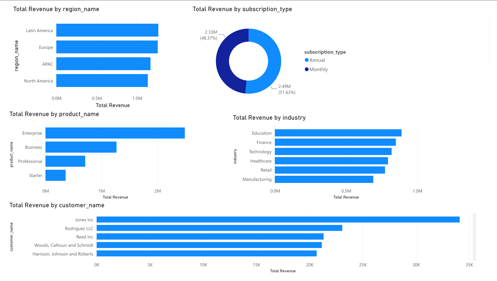
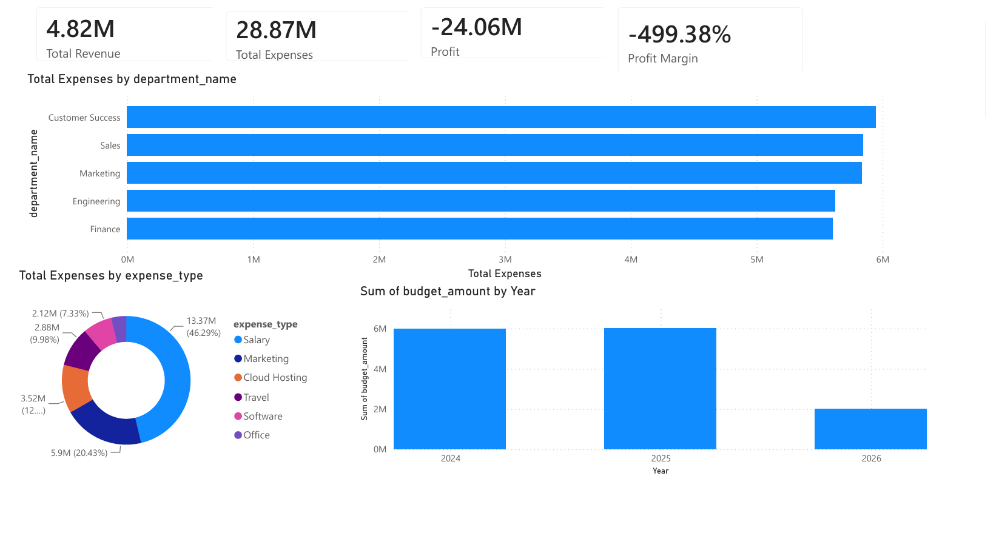
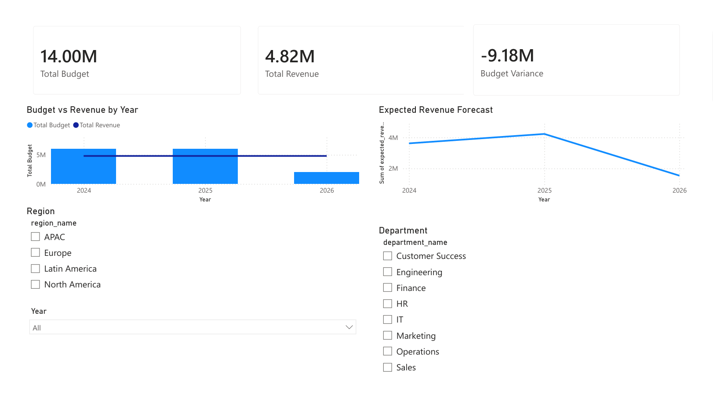

# CloudCore FP&A Analytics Platform

A Financial Planning & Analysis (FP&A) portfolio project demonstrating an end-to-end analytics workflow using Python, MySQL, SQL and Power BI.

This project simulates the finance function of a fictional SaaS business, **CloudCore**, using synthetically generated business data. It covers data generation, database design, SQL analysis and interactive Power BI dashboards for financial reporting and decision support.

---

# Project Overview

The aim of this project was to replicate a typical FP&A reporting workflow by:

- Generating synthetic business data using Python
- Storing and managing data within MySQL
- Analysing financial data using SQL
- Developing interactive dashboards in Power BI
- Presenting key financial insights through business intelligence reporting

**Note:** All data has been synthetically generated and does not represent a real organisation.

---

# Technology Stack

- Python
- Pandas
- Faker
- MySQL
- SQL
- Power BI
- Git
- GitHub

---

# Project Structure

```text
FPA-A-Project1/
│
├── dashboard/
│   └── CloudCore_FP&A_Dashboard.pbix
│
├── data/
│   └── raw/
│
├── python/
│
├── sql/
│
├── docs/
│
├── images/
│
├── README.md
└── requirements.txt
```

---

# Dashboard Preview

## Executive Dashboard


---

## Revenue Insights



---

## Financial Analysis



---

## Budget & Forecast



---

# Dashboard Features

## Executive Dashboard

- Revenue, Expenses and Profit KPIs
- Profit Margin
- Revenue trends
- Expense trends
- Executive summary of business performance

## Revenue Insights

- Revenue by Region
- Revenue by Industry
- Revenue by Product
- Customer Revenue Analysis
- Subscription Revenue Analysis

## Financial Analysis

- Departmental expenditure
- Expense category breakdown
- Financial KPIs
- Profitability analysis

## Budget & Forecast

- Budget vs Revenue comparison
- Budget variance
- Revenue forecasting
- Interactive filtering by:
  - Year
  - Region
  - Department

---

# Data Generation

Business data was generated using Python.

The project creates synthetic datasets for:

- Customers
- Employees
- Revenue
- Expenses
- Budgets
- Forecasts

The generated data includes:

- Multiple geographical regions
- Industry sectors
- Department structures
- Subscription pricing tiers
- Seasonal revenue patterns
- Business growth trends
- Budget allocations
- Financial forecasts

---

# SQL Analysis

The SQL scripts include:

- Database creation
- Table creation
- Data imports
- Business analysis queries

Example analyses include:

- Monthly revenue
- Monthly expenditure
- Revenue by product
- Top customers
- Departmental expenditure
- Budget analysis

---

# Power BI Report

The Power BI report consists of four interactive dashboard pages:

1. Executive Dashboard
2. Revenue Insights
3. Financial Analysis
4. Budget & Forecast

The report includes:

- DAX measures
- KPI cards
- Interactive slicers
- Business charts
- Cross-filtering
- Drill-down functionality

---

# Disclaimer

This project uses **synthetically generated data** for portfolio and demonstration purposes only. It does not contain any real financial or customer information.

---

#

Developed as an FP&A analytics portfolio project using Python, MySQL, SQL and Power BI.